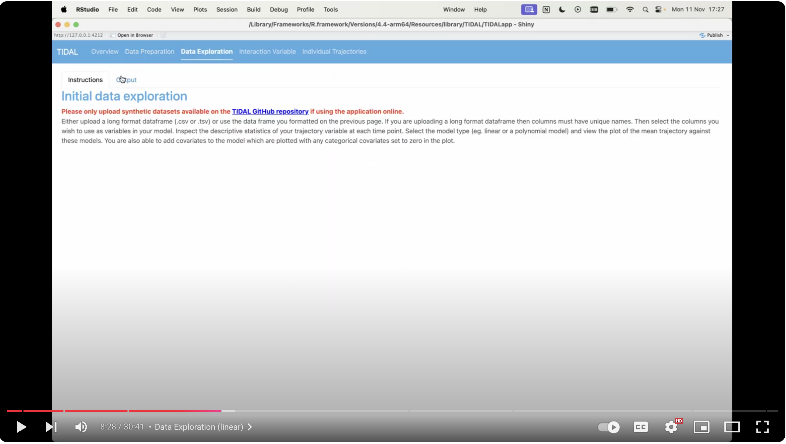

## Data Exploration

This is the first stage of trajectory modelling. Here the user can either upload a long format dataset or use the dataset formatted on the previous page (Data Preparation). They then select the desired outcome variable to model the trajectory on and a time variable, usually age. Note that the variable which the trajectory is modelled on must be measured on a continuous scale.

There is an option at this stage to add extra covariates or confounders to the model. These can be categorical or continuous and multiple variables can be selected from the drop-down menu. The user can run a linear or non-linear (quadratic, cubic, quartic) model according to which best fits their data.

Once a model has been fitted, TIDAL will output the fixed and random effects in the "Model Results" tab. The user can also examine predicted scores for specific ages in the "Scores At Ages" tab and extract Area Under the Curve metrics in the "Area Under Curve" tab. Finally, the user can download a PDF report from the "Download Results" tab.

