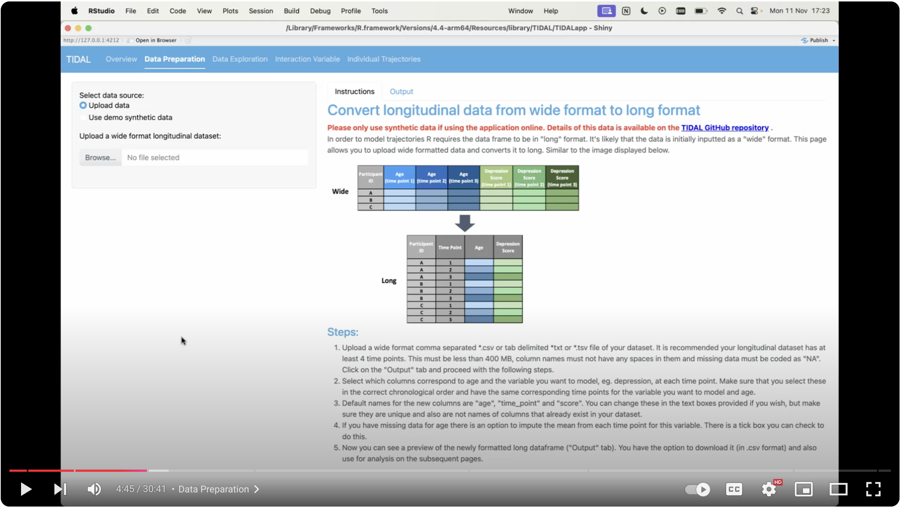

## Data Preparation

Many longitudinal datasets will be written in "wide" format, with each time point's data stored in a separate column. To analyse this data, it must first be converted into "long" format, with one column containing the time point names and one column containing the measurements.

This page allows the user to upload a wide format dataset and convert it into long format. The user selects which columns measure time and the phenotype they want to model trajectories on. There is also an option to impute mean age for missing age data in this step. Once converted into long format, there is the option to download the long version dataset as a .csv file.

To avoid errors when running, spaces in column names are replaced with underscores "_". If column names contain "(", ")" or "*" these are replaced with empty strings "". If you wish to change this, it is advised to edit your column names prior to uploading your data.

The "demo synthetic data" is the [Emotional regulation synthetic dataset](/docs/synthetic_data/emot_reg).

