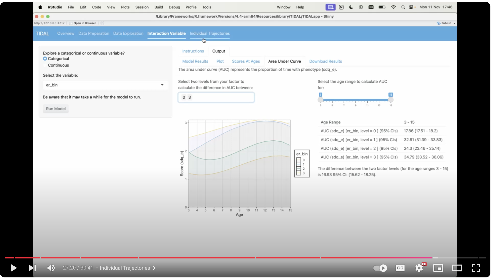

## Individual Trajectories

This page allows the user to view trajectories for specific individuals. The user can input specific IDs of interest, select a random sample of individuals to plot, or select a random sample from a specific category - e.g. female only. This allows comparison between individual trajectories and the group trajectories and may be useful for identifying whether a particular individual could be "on track" or not.

