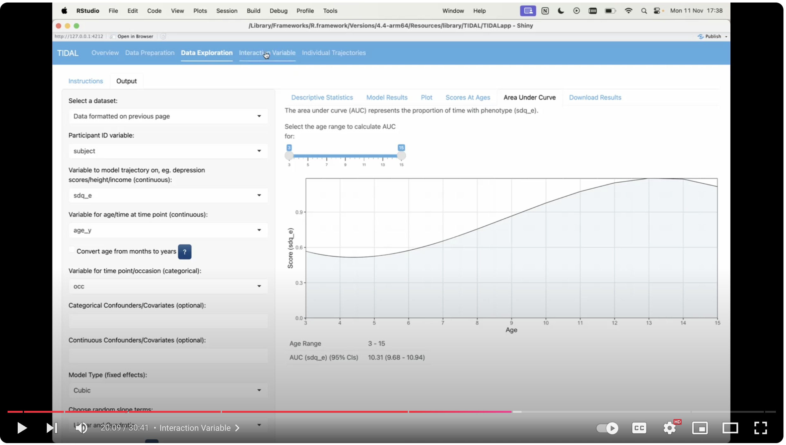

## Interaction Variable

On this page, the user can examine group differences or the effect of an interacting variable. The user can select a categorical or continuous variable from within the data and fit an updated model with the included interaction variable. The model type is inherited from the "Data Exploration" page alongside any covariates or confounders. Note that the interaction variable should not be included in the initial model if you wish to investigate it on this page. 

The output is similar to that from the "Data Exploration" page. In future we will be implementing features allowing the user to change factor level names and select the reference level to be used for categorical variables.

